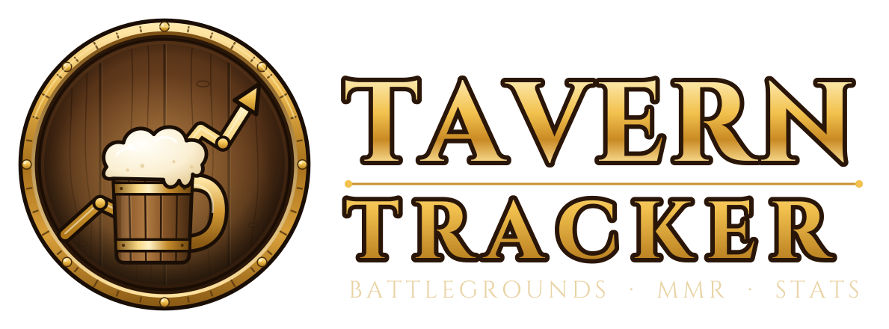

<p align="center"></p>

# Tavern Tracker

A free, standalone Hearthstone Battlegrounds tracker for Windows, with an MMR tracker in the style of tracker sites for other games: search any player, see their rank, rating and rating history.

## What it does

**In-game overlay (HDT-style)**
- **Left column**: available tribes in the lobby, **MMR start / current** for your session, and **latest games** with place and MMR change. Also shown on the Battlegrounds menu.
- **Lobby MMR**: every player in your lobby with their public rating, leaderboard rank and how many times you've been in a lobby with them. Knocked-out players fade.
- **Minion browser** (top right), like HDT's: tier emblems 1-6 (tier 7 appears once you can reach it) and a filter button. A tier lists its cards grouped by tribe (a two-tribe minion is listed under both; All Tribes first, then each tribe, Neutral, Spells). The filter lists one tribe or one keyword (Battlecry, Deathrattle, Avenge, Rally, Divine Shield, Taunt, End of Turn, Start of Combat, Reborn, Magnetic, Venomous…) across all tiers. Only cards this lobby can actually offer are shown: this patch's pool, the lobby's tribes, solo or duos, and the anomaly's tiers. Hover a card to see it; right-click a card to hide it.
- **Opponents' last boards** (like HDT): hover a player's portrait on the in-game leaderboard and the board they had when you last fought them appears at the top of the screen, with attack/health, golden, taunt, divine shield, reborn, venomous and windfury marks, their tier, and how many turns ago that was. It's recorded automatically at the start of every fight. The hovered portrait is read from the game like HDT/Firestone do; with memory reading off, the cursor position is used instead (solo).
- **Pick stats**: when you're offered heroes, trinkets or quests, each option gets HDT-style boxes above it: **Avg Placement · Tier · Pick Rate** (quests show **Completion %** and the average turn it's done). Quests also list the three best tribes for the reward, with an ✕ on tribes that aren't in your lobby. Hero averages are adjusted for your lobby's tribes, the way Firestone does it.
- **Turn counter** and your hero, place and tier.
- **Combat odds** (top centre): LETHAL · WIN · TIE · LOSS · LETHAL for every fight, plus average damage, using Firestone's open-source simulator. The last result stays up during shopping. Works in Duos too (both pairs; marked partial if a teammate board wasn't visible yet).
- Panel **size** and **transparency** are adjustable in Settings.

**Your games (from Hearthstone's own game log)**
- Records every Battlegrounds game: hero, final place, tavern tier, turns, length, solo or duos, ranked or casual.
- **Home**: your rating and rank, today's change, your session (average place, top-4 count, rating change, last placements), your rating graph, recent games.
- **Live game** card and a small **in-game overlay**: your place, tier, turn, how many players are left, your rating and session.
- **My games**: totals, average place, top-4 %, a placement chart, your most played heroes with their average place, full history.

**MMR tracker (from Blizzard's public leaderboard)**
- **Players**: search anyone on the US, EU or AP leaderboard (solo or duos) and open their profile: rating, rank, highest rating seen, change over 24 hours and 7 days, a rating graph and their recent rating changes.
- **Leaderboard**: browse the whole board with each player's 24-hour change; click anyone to open their profile.
- Rating history is built by saving a copy of the leaderboard every 20 minutes while the app is running. Graphs start from the first copy and fill in over time, per season.

## Install

1. Download the folder and double-click **`build.bat`**.
   - It needs the free .NET 8 SDK (only for building). If it's missing, the script says so; install it with `winget install Microsoft.DotNet.SDK.8` or from https://dotnet.microsoft.com/download/dotnet/8.0.
   - It runs the tests, then builds **`dist\TavernTracker.exe`**: one file with everything inside. Copy it anywhere.
2. Start `TavernTracker.exe`.
3. **The first time only: restart Hearthstone.** The app switches on Hearthstone's game log (`%LocalAppData%\Blizzard\Hearthstone\log.config`), and Hearthstone reads that file when it starts. If you use HDT or another tracker, logging is already on and nothing changes.
4. In **Settings**, pick your leaderboard region (US, EU or AP). Your BattleTag fills in automatically after your first game.

## How it works

| What | Where it comes from |
| --- | --- |
| Your games, heroes, placements, the lobby's heroes | Hearthstone's `Power.log` (the same log HDT, Firestone and others read). Parsing follows HearthSim's open-source log parsers. |
| Your exact MMR, the lobby's tribes, players' names | Hearthstone's memory (optional, on by default): read-only, the same way HDT and Firestone do it. Built on the open-source UnitySpy (MIT) via Firestone's maintained fork. |
| Combat odds | Both boards read from `Power.log` when combat starts, simulated with Firestone's simulator (MIT) running in V8 via Microsoft ClearScript. Its card data comes from Firestone's own card file, downloaded once a day. |
| Which minions are in the pool | Firestone's card file (rebuilt by Firestone every patch: pool flags, Timewarped/Darkmoon/buddy/solo/duo markers) and Firestone's tribe rules, corrected with HSReplay's live Battlegrounds pool (the list HDT uses). HearthstoneJSON is the fallback. Settings › Card pool shows which was used. |
| Hero, trinket and quest stats | Firestone's free public statistics (players in the top 50% of MMR, current patch), refreshed every 6 hours |
| Card art | HearthstoneJSON (art.hearthstonejson.com), cached locally |
| Ratings and ranks of other players | Blizzard's official leaderboard at hearthstone.blizzard.com |
| Rating history | Copies of that leaderboard the app saves while it runs |

Memory reading is read-only and can be switched off in Settings (the MMR, tribes and lobby names then aren't available). Nothing ever changes the game.

### Limits worth knowing

- **Pick stats come from Firestone, not HSReplay.** HDT's pick overlays use HSReplay's paid (Tier 7) data. That includes the "first place compositions" percentages under quests. Tavern Tracker uses Firestone's free data instead: the same Avg Placement / Tier / Pick Rate boxes, and under quests the best tribes for the reward with their average placement. The exact numbers will differ a little from HDT's.

- **Only players on the public leaderboard have a visible rating.** Blizzard publishes the top of the ladder only; anyone below the cutoff (shown on the Leaderboard page) has no public rating, and that includes you if you're below it. Your games and placements are still tracked either way.
- **Memory reading can break after a Hearthstone patch** until the reader is updated (HDT and Firestone have the same issue). Everything else keeps working; Settings shows the status.
- **Rating history only exists from when the app started saving the leaderboard.** Leave the app running while you play and the graphs fill in.
- **Same-name players**: the leaderboard shows names without the #1234, so two players with the same name look the same. The app warns you when that happens.
- Your rating updates as fast as Blizzard updates the leaderboard; the app re-checks it a few minutes after each ranked game.
- The overlay shows in windowed or borderless full-screen mode (not exclusive full screen), and only while Hearthstone is the active window.

### Updating the simulator

Firestone updates their simulator for every patch. To pull the newest version: install Node.js, then in the `sim` folder run `npm install` and `sh build.sh` (or the two `npx esbuild…` lines inside it on Windows), and rebuild with `build.bat`.

## Your data

Everything is in `%AppData%\TavernTracker` (Settings › Open data folder):

| File | What it is |
| --- | --- |
| `games.json` | Your recorded games |
| `history_<region>_<solo/duos>_s<season>.csv` | Rating history for everyone on that leaderboard |
| `latest_<region>_<solo/duos>.json` | The most recent leaderboard copy |
| `settings.json` | Your settings |
| `log.txt` | What the app did; useful if something looks wrong |

**Settings › Import a Power.log** reads older logs (Hearthstone keeps a folder per launch in its `Logs` folder) and adds games you played before installing Tavern Tracker.

## Project layout

```
src/TavernTracker.Core/     everything that isn't UI (tested)
  Hearthstone/              log.config setup, Power.log reader and Battlegrounds parser
  Leaderboard/              leaderboard download, rating history, background refresh
  Games/                    game storage and sessions
  Cards/                    Battlegrounds card data and card art cache
  TrackerEngine.cs          wires it all together
src/TavernTracker.Memory/   read-only memory reader (UnitySpy, MIT, see UnitySpy/LICENSE-UnitySpy.txt)
src/TavernTracker.App/      WPF app (built in code, no XAML): pages, rating chart, overlay panels, simulator host
sim/                        builds tt-sim.js from Firestone's simulator package
tests/TavernTracker.Tests/  test runner: dotnet run --project tests/TavernTracker.Tests
```

## Roadmap

- Opponents' last-seen boards when you hover the in-game leaderboard.
- Hero and minion images from HearthstoneJSON, hero stats across all your games, export to CSV.

## Fair play

Tavern Tracker only uses public leaderboard data and the log file Hearthstone writes for your own games. It doesn't reveal hidden information or automate anything. As with any third-party tool, use it at your own risk under Blizzard's terms.
